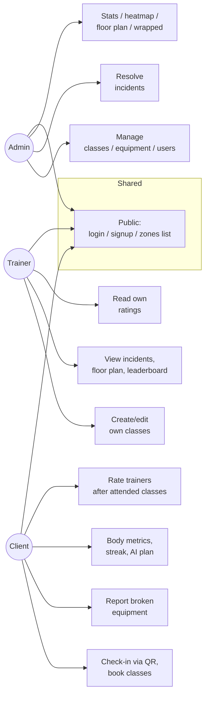

# FitFlow OS — roles & capabilities map

There are three roles in the system, set on the `User` row and encoded in
the JWT (`req.user.role`). Every NestJS controller route is locked down by
`@UseGuards(JwtAuthGuard, RolesGuard)` + `@Roles(...)`.

| Role | Goal | Typical workflow |
|---|---|---|
| **ADMIN** | Run the gym — schedule, staff, equipment, billing health | Login → dashboard → manage classes/equipment, triage incidents |
| **TRAINER** | Teach + see who's coming | Login → trainer console → see upcoming classes, ratings, live occupancy |
| **CLIENT** | Train, see progress, book classes | Login → check in via QR → book class → track metrics + AI plan |

## Quick visual

## Permission matrix — REST endpoints

Legend: ✅ allowed · ❌ forbidden · ⭕ allowed only for own data ·
🔓 no auth needed.

| Endpoint | ADMIN | TRAINER | CLIENT |
|---|:--:|:--:|:--:|
| **Auth** |
| `POST /auth/signup` | 🔓 | 🔓 | 🔓 |
| `POST /auth/login`  | 🔓 | 🔓 | 🔓 |
| `POST /auth/logout` | ✅ | ✅ | ✅ |
| **Public / mock** |
| `GET /zones`, `GET /zones/occupancy` | 🔓 | 🔓 | 🔓 |
| `GET /mock/my-pass` | 🔓 | 🔓 | 🔓 |
| `GET /gamification/achievements` | 🔓 | 🔓 | 🔓 |
| **Dashboard** |
| `GET /dashboard/stats` / `overview` / `recent-visits` / `top-clients` | ✅ | ❌ | ❌ |
| `GET /dashboard/floor-plan` | ✅ | ✅ | ❌ |
| `GET /dashboard/heatmap?userId=` | ✅ | ✅ | ⭕ self |
| **Users** |
| `GET /users?role=` | ✅ | ✅ | ❌ |
| `GET /users/:id/activity` | ✅ | ✅ | ⭕ self |
| **Gamification** |
| `GET /gamification/leaderboard` | ✅ | ✅ | ❌ |
| `GET /gamification/xp/:userId` | ✅ | ✅ | ⭕ self |
| `GET /gamification/streak/:userId` | ✅ | ✅ | ⭕ self |
| `GET /gamification/users/:id` (achievements) | ✅ | ✅ | ⭕ self |
| `GET /gamification/monthly-report/:userId` | ✅ | ✅ | ⭕ self |
| **Metrics** |
| `GET /metrics/users/:userId` (+ `/summary`) | ✅ | ✅ | ⭕ self |
| `POST /metrics/users/:userId` | ✅ | ✅ | ⭕ self |
| `DELETE /metrics/:id` | ✅ | ✅ | ⭕ own metric |
| **Classes** |
| `GET /classes/admin` (full list) | ✅ | ✅ | ❌ |
| `GET /classes/trainer` (mine) | ❌ | ✅ | ❌ |
| `GET /classes/client` (upcoming + my booking state) | ❌ | ❌ | ✅ |
| `POST /classes` (create) | ✅ | ✅ | ❌ |
| `PUT /classes/:id` (edit) | ✅ | ✅ | ❌ |
| `DELETE /classes/:id` | ✅ | ❌ | ❌ |
| `POST /classes/:id/book` (waitlist if full) | ❌ | ❌ | ✅ |
| `DELETE /classes/:id/book` (auto-promote next on waitlist) | ❌ | ❌ | ✅ |
| **Ratings** |
| `GET /ratings/leaderboard` | ✅ | ✅ | ✅ |
| `GET /ratings/trainers/:id` | ✅ | ✅ | ❌ |
| `POST /ratings/classes/:classId` | ❌ | ❌ | ✅ (after attended) |
| `GET /ratings/classes/:classId/mine` | ❌ | ❌ | ✅ |
| **Equipment** |
| `GET /equipment` | ✅ | ✅ | ✅ |
| `POST /equipment` (add new item) | ✅ | ❌ | ❌ |
| `PATCH /equipment/:id` | ✅ | ❌ | ❌ |
| `DELETE /equipment/:id` | ✅ | ❌ | ❌ |
| `POST /equipment/incidents` (report broken) | ✅ | ✅ | ✅ |
| `GET /equipment/incidents` (inbox) | ✅ | ✅ | ❌ |
| `PATCH /equipment/incidents/:id` (resolve / progress) | ✅ | ❌ | ❌ |
| **AI** |
| `POST /ai/workout-plan` | ✅ | ✅ | ✅ |
| **Attendance** |
| `GET /attendance/me/open` | ✅ | ✅ | ✅ |
| `POST /attendance/check-in` (with optional `userId` for staff) | ✅ | ✅ | ✅ |
| `POST /attendance/check-out` / `/check-out/:id` | ✅ | ✅ | ⭕ own visit |

## UI navigation per role

Header nav adapts to `localStorage.fitflow_role`:

| Role | Top-level routes |
|---|---|
| **ADMIN** | `/admin` (dashboard) · `/admin/floor-plan` · `/admin/classes` · `/admin/equipment` · `/dashboard/wrapped` |
| **TRAINER** | `/admin` (trainer console) · `/admin/floor-plan` · `/admin/classes` · `/dashboard/wrapped` |
| **CLIENT** | `/client` · `/client/classes` · `/client/equipment` · `/client/metrics` · `/client/workout-plan` · `/dashboard/wrapped` |

## What changed in this commit vs the previous one

- ❌ Hydration error on `/dashboard/wrapped` — fixed by reading `userId` inside `useEffect`, not during SSR.
- ❌ "Can't resolve incident" — actually the *real* cause was a stale JWT in localStorage from the previous DB reset (`401 Unauthorized` was swallowed). `apiFetch` now wipes the token + role on any `401`, so the next request lands on `/login`.
- ❌ "Can't create a class" — there was no UI for it. Added `+ New class` button on `/admin/classes` (trainer + admin), edit modal per row, and a `DELETE /classes/:id` route for admins.
- ➕ Equipment is now CRUD-able by admin: `+ Add equipment` button on `/admin/equipment` + per-row Delete, backed by `POST /equipment` and `DELETE /equipment/:id`.
- ➕ `GET /users?role=TRAINER` so the class form can populate a trainer dropdown.
